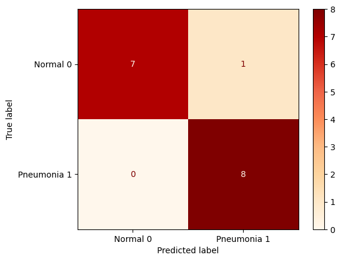
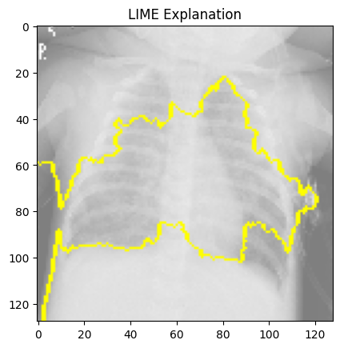
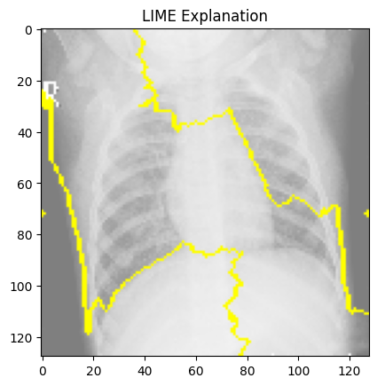

# Pneumonia Model Analysis

**Author**: [Jack Locke](mailto:jackdlocke@gmail.com)

# Overview
1.  Business Understanding
2.  Data Understanding
3.  Data Preparation
      *   Directory path for train/test/valid images
      *   Create image/label datasets and reshape 
      *   Change dimensions of images and labels
      *   Standardize images
      *   Class Imbalance - class weights
4.  Modeling
      *   Baseline
      *   Gridsearch/Tuned Model
      *   Regularization 
5.  Evaluation
      *   Final Model
      *   LIME Interpretability
6.  Conclusions
      *   Limitations
      *   Recommendations/Next Steps

# Business Understanding
The business stakeholder is a diagnostic imaging center exploring the use of neural networks to help predict when patients have pneumonia. My project uses X-ray images of patients with and without pneumonia. The model aims to predict whether someone has pneumonia or not. The importance of the model revolves around the costs associated with false positives and false negatives. The false positive would be predicting someone does have pneumonia when they don’t (wasted time/resources/money). The false negative would be predicting someone didn't have pneumonia when they did (future health issues). I will find an appropriate trade-off between our two costs, focusing on minimizing future health issues. The imaging center can use the model to aid doctors in their decision-making, leading to better efficiency, accuracy, and decreased workload. All leading to more growth for the business. My analysis will use the CRISP-DM (Cross-industry standard process for data mining) methodology.
# Data Understanding
I am working with a dataset presented by Kaggle. The dataset was gathered from one medical center located in a prominent city in China, Guangzhou. “Chest X-ray images (anterior-posterior) were selected from retrospective cohorts of pediatric patients of one to five years old from Guangzhou Women and Children’s Medical Center, Guangzhou. All chest X-ray imaging was performed as part of patients’ routine clinical care.” The dataset contains almost 6,000 images in two categories (Pneumonia/Normal). It is important to note that this is data from one location, and the images are all children, which causes some limitations. I will discuss these in more detail in the limitations section at the end of the notebook. Below is a link to the dataset.

1* Citation/Data: https://www.kaggle.com/datasets/paultimothymooney/chest-xray-pneumonia?resource=download

# Data Preparation
The data needs some initial transformations/preparation to ensure the images can be used by the model. I have to change the shape and dimensions of the images and labels to do this. I also need to standardize the images to reduce their complexity, which will help improve model performance and efficiency. Additionally, class imbalance is present in the datasets, with the minority class being “normal”. Adjusting the class weights will provide more weight to the minority class and less weight to the majority class. This will help reduce bias within the model.

* Directory path for train/test/valid images
* Create image/label datasets and reshape
* Change dimensions of images and labels
* Standardize images
* Class Imbalance - class weights

# Model
I am trying to assess two categories within an X-ray image, so I will use a binary image classification neural network. My goal to ensure my model performs the same on the training images as on unseen images. I will use the three different datasets to ensure the model is generalizable (train/test/valid). Since I am focused on minimizing the false negatives, I will be looking at recall as my metric for these models.

### Baseline
Modeling is an iterative process, so a baseline model is needed. I will use the baseline model as a reference point as I try to improve the performance of my model. I will create a simple model to represent this. The model will only contain two neurons in its initial layer. I chose an epoch of 6 and batch size of 3 because this combination ensures all images will be passed through the model when training the baseline. Because this is a binary image classification problem, the output layer must contain just one neuron, and the activation function must be “sigmoid.” When fit is applied, you see the use of class weights to handle class imbalance. Additionally, you will see the model takes in the training data and uses the test data for comparison, helping better understand how generalizable the model is. The train and test data showed similar loss metrics, but the recall score is scattered. To fix this issue, I will apply Gridsearch for the next model. The baseline model is currently in a function so it can be wrapped in order to be applied to Gridsearch.

### Gridsearch/tuned model
I am applying Gridsearch to find the optimal parameters for my model. I will examine the number of neurons, optimizer, activation function, epochs, and batch size. After receiving the best parameters, I applied them to the “tuned model.” The tuned model had much better and consistent recall values, showing improvement in the model overall. However, the loss is less for the training set than for the test set, which is a sign of overfitting. To fix overfitting, I must apply a regularization technique.

### Regularization
For this model, I applied the Dropout technique. This randomly selects neurons to use and removes the others (remember, my model currently has 20 neurons). This will reduce some of the noise the model is picking up on, which is causing it to overfit. The results for both the recall and loss scores show a decrease in overfitting from the tuned model. There is still a bit of overfitting, but if I continue to try and regularize the model, the metrics will start to fluctuate greatly. Given the limitations of the dataset, this is the best-performing model at this time. I will give a visual of the performance of the regularized model on the test images/labels via a confusion matrix.
# Evaluation
Finally, I must evaluate our model on the unseen data (valid images/labels). The model performed well on the unseen images, confirming our model is generalizable. I have a perfect recall score, 100%, with a loss of 0.19. I used a confusion matrix to visualize the predictions. As more data is acquired, the recall score will lower slightly.

Additionally, I used LIME to take individual instances to visually show what the model was looking at in order to make its prediction. I represent two images, one with pneumonia and one without pneumonia.

* **Final Model: reg_model**



* **LIME Visualization** 

Pnuemonia:




Normal:





# Conclusion
My model uses X-ray images to predict whether someone has pneumonia while focusing on minimizing the cost of additional health risks from misclassification. The neural network will help the diagnostic imaging center identify pneumonia, leading to greater accuracy, efficiency, and decreased workload for doctors and the business. Overall, these factors will lead to more significant growth for the business and better patient care. Given these findings and future data enrichment, I can build on my model recommendation and know where to proceed next.

## Limitations
At this stage, the data is extremely limited. Mainly, I have a small number of images to use. Neural networks perform better when you give them more data. I do not have information on every x-ray image in which someone had pneumonia. The images are also all children, limiting the ability of the model to perform well when given images of varying age groups. Also, the images are taken from one medical center in one city. This will also limit its ability to perform well on other unseen data. The model is limited in its ability to reproduce similar results due to the limitations of the dataset. Gathering/enriching the data in the future will help reduce these limitations.

## Recommendations/Next Steps
I recommend investigating this model further as we enrich the data. We need to gather images from more age groups and locations. Also, because children tend to be around the same size, we need to gather more images of individuals of varying sizes.

Data Enrichment:

* Age Groups
* Locations
* Sizes

## For More Information

See the full analysis in the notebook or review this [presentation](presentation.pdf).

For additional info, contact Jack Locke at [jackdlocke@gmail.com](mailto:jackdlocke@gmail.com)

## Repository Structure

```
├── images
├── README.md
├── presentation.pdf
└── notebook.ipynb
```
## Citations

* 1: https://www.kaggle.com/datasets/paultimothymooney/chest-xray-pneumonia?resource=download
* 2: https://medium.com/@ravi.abhinav4/improving-class-imbalance-with-class-weights-in-machine-learning-af072fdd4aa4#:~:text=Using%20Class%20Weights%20to%20Address%20Class%20Imbalance,-Class%20weights%20offer&text=The%20idea%20is%20to%20assign,make%20better%20predictions%20for%20it.
* 3: https://keras.io/api/callbacks/early_stopping/
* 4: https://machinelearningmastery.com/grid-search-hyperparameters-deep-learning-models-python-keras/
* 5: https://github.com/alexandrusocolov/LIME-for-medical-imaging
* 6: https://chum.medium.com/model-explanations-using-lime-8c5b0fe94363


